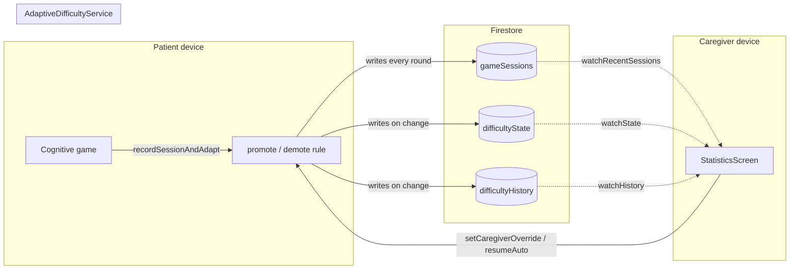

# How the Adaptive Difficulty Engine and Statistics Screen Relate

## The short version

`AdaptiveDifficultyService` **owns the rules** (what level a game is at, when it changes, why). `StatisticsScreen` **owns nothing** — it has no difficulty logic of its own at all. It's a thin UI layer that subscribes to the engine's live data and forwards two human actions (override, resume auto) back into it. Every number Statistics shows is something the engine already computed and stored; Statistics never recomputes a level, an accuracy, or a decision itself.

This matters because it's the same rule the whole adaptive engine was built around: **one place decides, everywhere else just displays or asks**. If a second screen ever needed to show difficulty info, it would call the exact same service methods — nothing about "how difficulty works" would need to be duplicated or re-implemented.

## What Statistics reads from the engine

Statistics is built around one patient at a time (picked from a dropdown), then one card per game (from `kGameCatalog`, the static list of all 13 games). Each card is driven by three independent live streams, all coming from `AdaptiveDifficultyService`, none of them touched by Statistics itself:

| What's shown | Where it comes from | Service call |
|---|---|---|
| Current level (1–3), whether it's `Auto` or caregiver-set, the `Frozen` badge | The live `difficultyState/{gameId}` doc for this patient | `watchState(patientId, gameId)` |
| The accuracy-trend line chart (last 10 sessions, oldest → newest) | The `gameSessions` collection, filtered to this patient + this game | `watchRecentSessions(patientId, gameId, limit: 10)` |
| The combined, newest-first change history list at the bottom of the screen | The `difficultyHistory` collection, filtered to this patient (across *all* their games at once) | `watchHistory(patientId)` |

None of these are one-time reads — they're `Stream`s wired into `StreamBuilder`s, so if a patient finishes a game on their own device right now, the caregiver's already-open Statistics screen updates itself without anyone refreshing anything.

## What Statistics writes back into the engine

Statistics is also the **only place** a human can intervene in the automatic system, and both actions go through the exact same service the automatic engine itself uses — there's no separate "caregiver override" code path duplicating the state machine's writes:

- **Override** — opens a dialog requiring a level (1/2/3) and a *non-empty* reason, then calls `AdaptiveDifficultyService.setCaregiverOverride(...)`. This is the same transactional write path (state + history record, together, atomically) that an automatic promotion or demotion uses — the only difference is `source: 'caregiver'` and `frozen: true` instead of `source: 'auto'`.
- **Resume Auto** (only shown when a game is currently frozen) — calls `resumeAuto(...)`, which unfreezes the game without touching its current level, letting the automatic promote/demote rule pick back up from wherever it's sitting.

## Putting it together

The arrows only ever point *through* `AdaptiveDifficultyService` in both directions — Statistics never reads or writes Firestore directly for anything difficulty-related, and the 13 game files never talk to Statistics. The service is the only thing both sides depend on, which is what makes it safe for the automatic engine and the manual override to coexist without stepping on each other: whichever one writes last is whatever the *other* side's next `StreamBuilder` update will show, with the `frozen` flag deciding whether the automatic side is even allowed to write at all.

## Why it's built this way, not screen-first

It would have been possible to write the promote/demote logic directly inside `StatisticsScreen` or inside each game screen. It wasn't, for the same reason the accuracy-trivialization bug (see `ADAPTIVE_DIFFICULTY_CONCEPT.md`) was worth fixing everywhere at once: a rule that exists in exactly one place can only be wrong in one place, and testing it, changing a threshold, or explaining it in a report only ever means talking about `adaptive_difficulty_service.dart` — not chasing the same logic across 13 game files and a caregiver screen that happened to grow their own copies of it.
